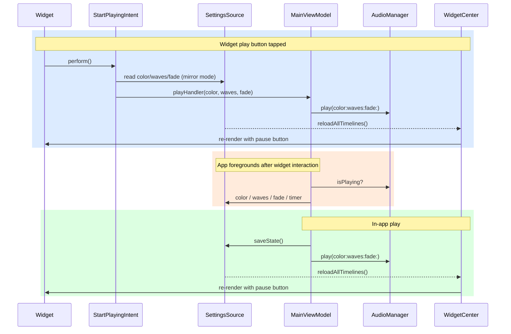

# Architecture

## MainViewModel

`MainViewModel` is an `@Observable` class that owns all UI state and coordinates between the audio layer (`PlaybackService`) and persistence layer (`SettingsSource`)

### Interaction with PlaybackService

`PlaybackService` is a protocol that `AudioManager` conforms to. This makes the audio layer fully injectable and mockable in tests.

`MainViewModel` never reads back from `PlaybackService` other than `isPlaying`, which is checked in `appWillEnterForeground()` to reconcile UI state after the app returns from the background (e.g. timer may have expired while backgrounded).

### Interaction with SettingsSource

`SettingsSource` reads and writes to an app-group `UserDefaults`, which is shared with the widget extension. Any change that affects the widget triggers `WidgetCenter.shared.reloadAllTimelines()` automatically inside the setter.

**Load flow** — called from `init` and also directly from `appWillEnterForeground`.
**Save flow** — `saveState()` is `private` and called from:

- `play()` — always, before starting audio
- `toggleTimer()` — only when `isPlaying`, because `play()` will save if not yet playing

### Foreground sync

`appWillEnterForeground()` reconciles state that may have drifted while the app was backgrounded:

1. Sync `isPlaying` from `audio.isPlaying` (timer may have paused audio)
2. If still playing, re-read color/waves/fade/timer from `SettingsSource` (an intent may have changed them)

---

## Widget

The widget uses `SettingsSource` to read the current color/waves/fade state and render its UI. When the widget's play/pause button is tapped, `StartPlayingIntent` or `StopPlayingIntent` fires.

After a widget interaction the next foreground brings `appWillEnterForeground()` which re-reads `SettingsSource` and `audio.isPlaying` to reconcile any drift.

Any in-app state change that should be reflected in the widget (color, waves, fade, timer) goes through `SettingsSource` setters, which call `WidgetCenter.shared.reloadAllTimelines()` automatically on change.

