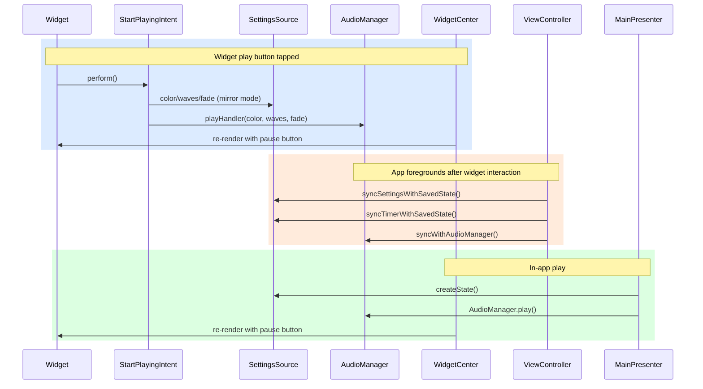

# Widget Architecture

`AudioManager` singleton owns the `AVAudioPlayer` and all sound "state". When a widget intent fires, the app is launched in the background and `playHandler`/`stopHandler` call `AudioManager`. If the app is opened after that, it attempts to "sync" its UI to the state from `AudioManager` in `ViewController.syncWithAudioManager()`. If the app isn't in memory, 
`UserDefaults` in `SettingsSource` is used to load the user's last state. Additionally, the widget uses `SettingsSource` to determine its state unless the "mirror" setting is off.

